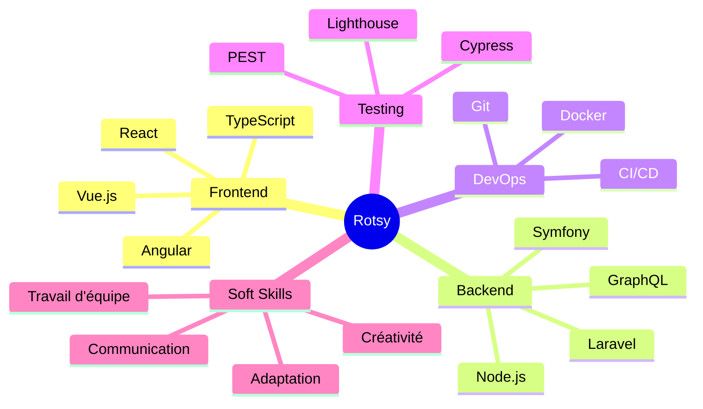

<div align="center">

# 👨‍💻 Rotsy RAHARINOSY


[](https://www.linkedin.com/in/rotsy-raharinosy)
[](mailto:rotsyni@gmail.com)
[](https://twitter.com/rotsyin)
[](https://github.com/rotsyin)


</div>

---

## 🎯 À Propos de Moi

```typescript
const rotsy = {
    location: "📍 Antananarivo, Madagascar",
    role: "💼 Full Stack Developer",
    education: "🎓 Master en Génie Logiciel",
    passion: "🚀 Building scalable & innovative solutions",
    currentFocus: ["Architecture", "CI/CD", "Clean Code"],
    funFact: "⚡ Je transforme le café en code ☕➡️💻"
};
```

<details>
<summary>📖 <b>En savoir plus sur mon parcours</b></summary>

<br>

Développeur Full Stack passionné avec **+5 ans d'expérience** dans la conception et le développement d'applications web robustes et scalables. 

🎯 **Spécialisations :**
- Architecture logicielle et design patterns
- Développement d'APIs REST & GraphQL
- Tests automatisés et CI/CD
- Optimisation des performances
- Gestion de projets agiles

💡 **Philosophie :** Code propre, solutions élégantes, amélioration continue

</details>

---

## 🛠️ Stack Technique

<div align="center">

### 💻 Frontend


### ⚙️ Backend


### 🗄️ Databases


### 🧪 Testing & Tools


</div>

---

## 📊 Statistiques GitHub

<div align="center">
  


</div>

<div align="center">
  
[](https://git.io/streak-stats)

</div>

<div align="center">
  


</div>

---

## 💼 Expérience Professionnelle

<details open>
<summary><b>🏢 Développeur Full Stack - Menuiserie de la Grande Ile</b> (Nov 2023 - Présent)</summary>

<br>

**Mission :** Développement d'une plateforme web complète de gestion des commandes

**Réalisations :**
- ✅ Création d'un système de suivi end-to-end (devis → livraison)
- 🔐 Implémentation d'un système d'authentification et d'autorisation robuste
- 💾 Mise en place de systèmes de backup et de récupération de données
- ⚡ Optimisation continue des performances (temps de chargement -40%)
- 🐛 Résolution proactive de bugs et amélioration continue

**Stack :** `Symfony` `Ionic` `Angular` `Node.js` `TypeScript` `Docker`

</details>

<details>
<summary><b>🔬 Développeur - SmartPredict</b> (Oct 2022 - Présent)</summary>

<br>

**Mission :** Conception et développement d'une plateforme de tests automatisés

**Réalisations :**
- 🧪 Design complet de la plateforme de tests automatisés
- 🔄 Automatisation des tests dans un pipeline CI/CD
- 🛠️ Maintenance et optimisation des fonctionnalités existantes
- 📊 Amélioration de la couverture de tests de 30% à 85%

**Stack :** `TypeScript` `GraphQL` `Cypress` `Google Lighthouse` `Node.js`

</details>

<details>
<summary><b>💻 Développeur Full Stack - MANAO SIDINA</b> (Mai 2022 - Août 2022)</summary>

<br>

**Projets réalisés :**
- 📊 MANAO Bureautique - Application de type tableur
- 📦 Système de gestion commerciale (factures et stocks)
- 🎨 Interfaces utilisateur modernes et intuitives

**Stack :** `PHP CodeIgniter` `Vue.js` `jQuery` `MySQL` `Git`

</details>

<details>
<summary><b>📋 Administrateur de vente - Airtel Madagascar</b> (Mars 2021 - Nov 2021)</summary>

<br>

**Responsabilités :**
- 📄 Gestion et organisation des factures (édition, envoi, réception, paiement)
- 👥 Coordination avec les équipes Front Office et clients
- 🎓 Encadrement de 2 stagiaires

**Stack :** `PHP CodeIgniter` `jQuery` `MySQL` `VBA Excel`

</details>

---

## 🎓 Formation

<div align="center">

| 🎓 Diplôme | 🏫 Institution | 📅 Année |
|:-----------|:---------------|:---------|
| **Master** en Génie Logiciel et Base de Données | École Nationale d'Informatique, Fianarantsoa | 2019 |
| **Licence** en Génie Logiciel et Base de Données | École Nationale d'Informatique, Fianarantsoa | 2017 |

</div>

---

## 🌟 Compétences Clés

<div align="center">



</div>

---

## 🏆 Points Forts

<table align="center">
<tr>
<td align="center" width="50%">

### 🎯 Technique
- Architecture logicielle
- Clean Code & Design Patterns
- API REST & GraphQL
- Tests automatisés
- Performance optimization

</td>
<td align="center" width="50%">

### 💪 Soft Skills
- Travail d'équipe
- Communication efficace
- Capacité d'adaptation
- Créativité & Innovation
- Résolution de problèmes

</td>
</tr>
</table>

---

## 🌐 Langues

| Langue | Niveau |
|:-------|:-------|
| 🇫🇷 **Français** | Courant |
| 🇬🇧 **Anglais** | Notions |

---

## 📫 Me Contacter

<div align="center">

### Discutons de votre prochain projet ! 💬

[](mailto:rotsyni@gmail.com)
[](tel:+261348035005)
[](https://maps.google.com)

</div>

---

<div align="center">

### 💡 Citation du jour


---

### 🎵 Actuellement en écoute

[](https://open.spotify.com/user/VOTRE_USER_ID)

---


**✨ "Experienced Developer with a Passion for Building Innovative Solutions" ✨**


</div>
